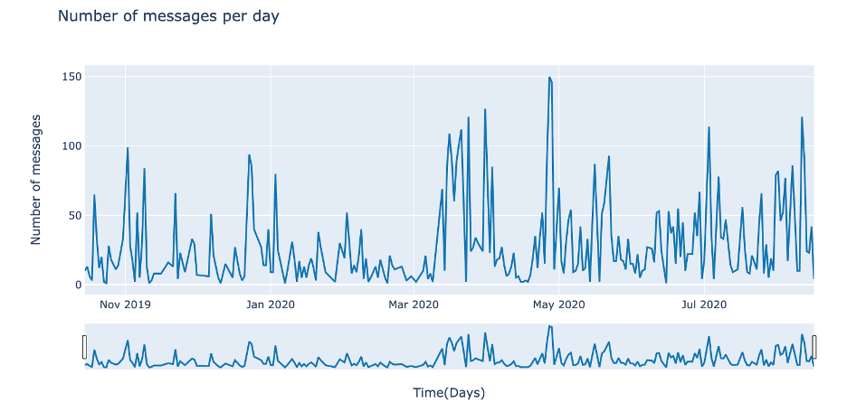

# Collect, transform, and analyze data from a Whatsapp group

In this project, I am showing how to collect the data from a whatsapp group. After obtaining the text file, I explain how to transform the unstructured data to a structured dataframe. I explore this data using Plotly and I do a few analysis and show some trends among the users of this group.

### [Medium Article - Get to know your friends with Natural Language Processing (NLP)](https://towardsdatascience.com/get-to-know-your-friends-with-natural-language-processing-nlp-38a1f6e56e09) 

